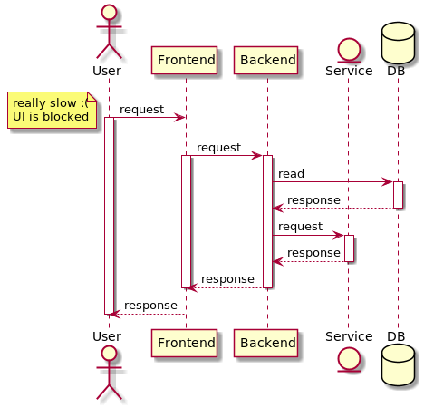
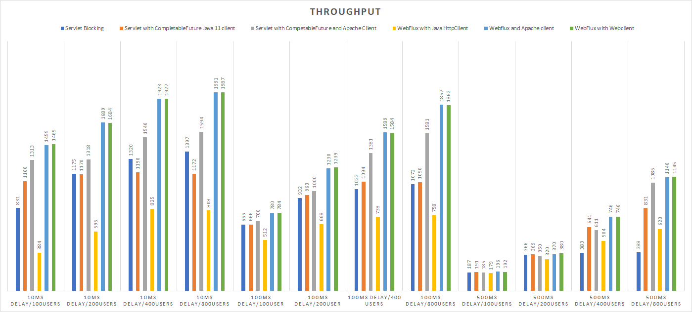

# Going Reactive with Spring Webflux

- <i class="fa fa-user"></i>&nbsp;Christoph Welcz
- <i class="fa fa-twitter" aria-hidden="true"></i>&nbsp;[@ChristophWelcz](https://twitter.com/ChristophWelcz)
- <i class="fa fa-github" aria-hidden="true"></i>&nbsp;[github.com/enolive/going-reactive-spring](https://github.com/enolive/going-reactive-spring)

<--->

## Why?

* avoid blocking calls
* performance
* programming model

<-->

### Blocking Calls



<-->


[&copy; geek and poke 2014](http://geek-and-poke.com/geekandpoke/2014/9/2/modern-design-paterns) 
<!-- .element: class="small" -->

<--->

## Resources



https://medium.com/@filia.aleks/microservice-performance-battle-spring-mvc-vs-webflux-80d39fd81bf0
<!-- .element: class="small" -->

<-->

> **Spring Webflux** with WebClient and Apache clients 
> wins in all cases. The most significant 
> difference (**4 times** faster than blocking Servlet) 
> when underlying service is slow (500ms).

<--->

## Programming Model

Blocking

```java
public void sendPasswordMail(String userAddress) {
    User user = repository.findByMailAddress(userAddress);
    Template template = templateRegistry.getTemplateForLostPassword();
    Email mail = mailFactory.create(user, template);
    mailService.send(mail);
}
```

<-->

Callback Hell

```java
public void sendPasswordMail(String userAddress) {
    repository.findByMailAddressCb(userAddress, user -> {
        templateRegistry.getTemplateForLostPasswordCb(template -> {
            mailFactory.createCb(user, template, mail -> {
                mailService.send(mail);
            });
        });
    });
}
```

<-->

Promises/Reactive

```java
public Mono<Void> sendPasswordMail(String userAddress) {
    return repository
        .findByMailAddressAsync(userAddress)
        .zipWith(templateRegistry.getTemplateForLostPasswordAsync())
        .flatMap(mailFactory::createAsync)
        .flatMap(mailService::sendAsync);
}
```

<--->

## Introducing Spring Webflux

* since Spring Boot 2.0
* encourages non blocking calls
* based on Project Reactor

<-->

### Mono and Flux

* "Promise on steroids"
* Mono: single value
* Flux: stream of values
* Error handling

<-->

```java
Mono.just(42);
Mono.fromCallable(() -> "Hello, World");
Mono.empty();
Mono.error(new RuntimeException("I AM ERROR"));
```

<-->

```java
Mono.just("Christoph")
    .map(name -> "Hello, " + name + "!")
    .subscribe(result -> System.out.println(result));
```
```java
Flux.range(1, 100)
    .map(fizzBuzz::calculate)
    .subscribe(item -> System.out.println(item));
```

<-->

### lots of useful functions

<-->

<section tagcloud large>
filter 
map 
reduce 
flatMap 
switchIfEmpty
onErrorResume
doOnError
doOnNext
delayElements 
cache 
buffer 
publishOn 
subscribe 
zipWith 
log 
repeat 
retry
retryBackoff
window
block
collect
</section>

<--->

## Demo

👩‍💻

<--->

## Out of real life

<-->

```java
public Mono<ImportResult> importPayRolls(String requestId, 
                                         String importUri, 
                                         boolean mock) {
    return extractor
        .readPayrolls(requestId, importUri, mock)
        .flatMap(checkImport::performCheck)
        .flatMap(performImport(requestId))
        .onErrorResume(
            ImportMessageException.class, 
            this::storeResultMessageForFrontend)
        .log();
}
```

<-->

```java
public Flux<RegistrationResult> register() {
    final int defaultDelay = 200;
    return Flux.fromIterable(repository.findAll())
               .map(this::transformToJson)
               .delayElements(Duration.ofMillis(defaultDelay))
               .flatMap(registration::registerConsultantAndClient)
               .log();
}
```

<-->

```java
@Scheduled(cron = "0 0 22 * * *")
@PostConstruct
public void register() {
    LOGGER.info("invoking registration...");
    service.register()
           .publishOn(Schedulers.elastic())
           .subscribe();
}
```

<--->

# Drawbacks

<-->

## Compatibility with some modules

<-->

|Module         |Solution                       |
|---------------|-------------------------------|
|Spring Fox     |Migrate to Springdoc OpenAPI   |
|Spring HATEOAS |Support coming with 2.2        |
|JDBC           |R2DBC coming with 2.3          |
|Netflix Zuul   |Migrate to Spring Cloud Gateway|
|Camunda        |tba                            |

<-->

## New programming paradigm

* Functional + Reactive Programming = FRP

<-->

👊 Learn FRP! 👊

<--->

# Thanks for listening 😍

- <i class="fa fa-user"></i>&nbsp;Christoph Welcz
- <i class="fa fa-twitter" aria-hidden="true"></i>&nbsp;[@ChristophWelcz](https://twitter.com/ChristophWelcz)
- <i class="fa fa-github" aria-hidden="true"></i>&nbsp;[github.com/enolive/going-reactive-spring](https://github.com/enolive/going-reactive-spring)
